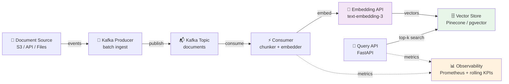
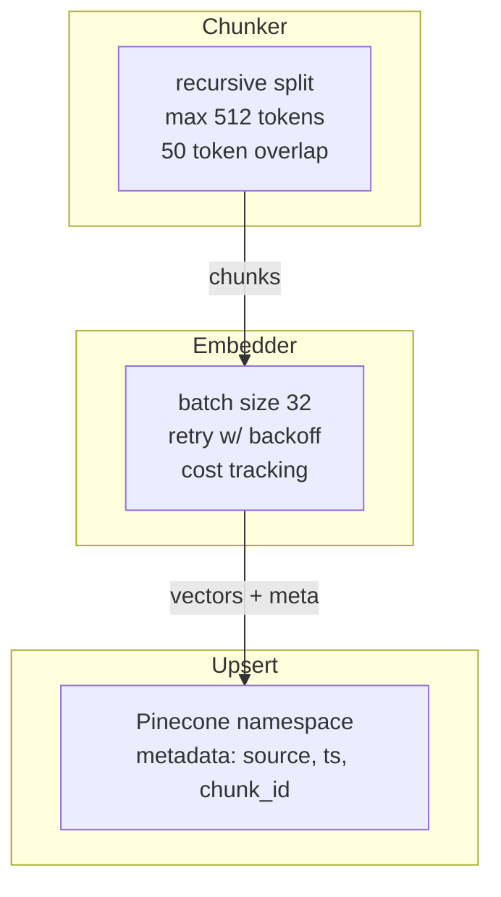
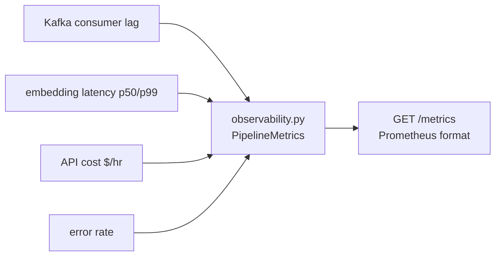
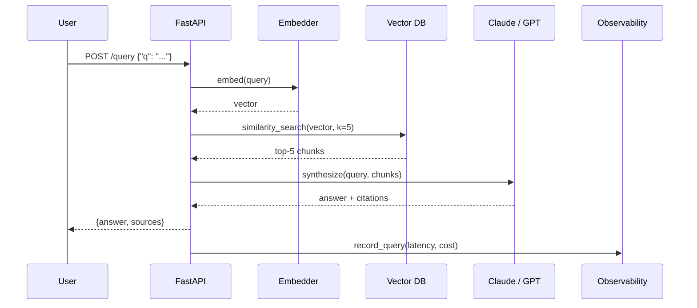

# GenAI Data Engineering Portfolio — Architecture

Production-grade GenAI + data engineering projects.

## Project 1: Real-Time RAG Pipeline

### End-to-End Flow

### Chunking + Embedding Pipeline

### Observability

## Request Flow (Query API)

## Tech Stack

| Layer | Technology |
|-------|------------|
| Ingestion | Apache Kafka, Python |
| Processing | PySpark (streaming), asyncio |
| Embedding | OpenAI text-embedding-3-large |
| LLM | Claude Sonnet 4.6, GPT-4 |
| Vector DB | Pinecone, pgvector |
| API | FastAPI, Pydantic |
| Observability | Prometheus, structlog |
| Infra | Docker, AWS (EKS / Lambda) |

## SLOs

| Metric | Target |
|--------|--------|
| Query latency p95 | <2s |
| Embedding cost / 1M tokens | <$0.13 |
| Kafka consumer lag | <100 messages |
| Error rate | <0.1% |
| Retrieval precision@5 | >85% |
